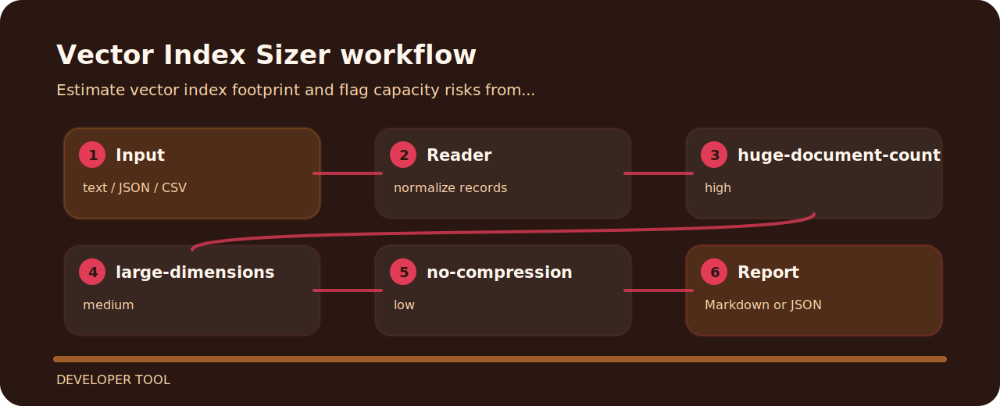

# Vector Index Sizer


Vector Index Sizer is meant for quick pull-request checks around vector search sizing. It favors explicit rules over a bulky dashboard.

## Where the logic lives

```text
.github/        CI workflow
examples/       sample inputs
src/            package source
tests/          test coverage
```

## Checks in plain language

| Signal | Level | What it flags | Fix direction |
| --- | --- | --- | --- |
| `huge-document-count` | high | document count is very large | Estimate shard count, cost, and ingestion window. |
| `large-dimensions` | medium | embedding dimension is large | Consider smaller embeddings or compression. |
| `no-compression` | low | compression is not configured | Evaluate quantization or scalar compression. |

## Finding map



## Command path

```bash
git clone https://github.com/mertefekurt/vector-index-sizer.git
cd vector-index-sizer
python -m pip install -e ".[dev]"
vector-index-sizer examples/sample.txt
```
